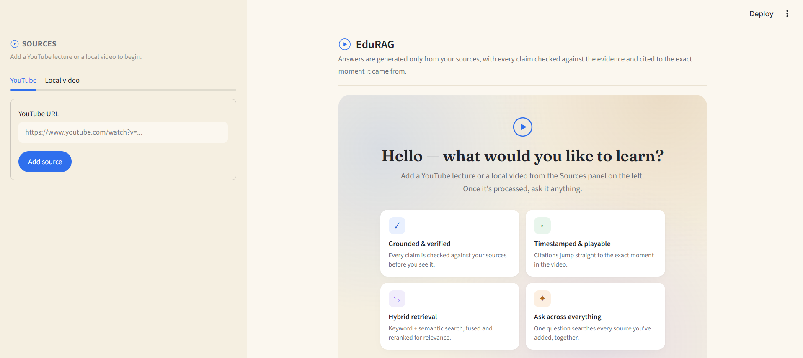
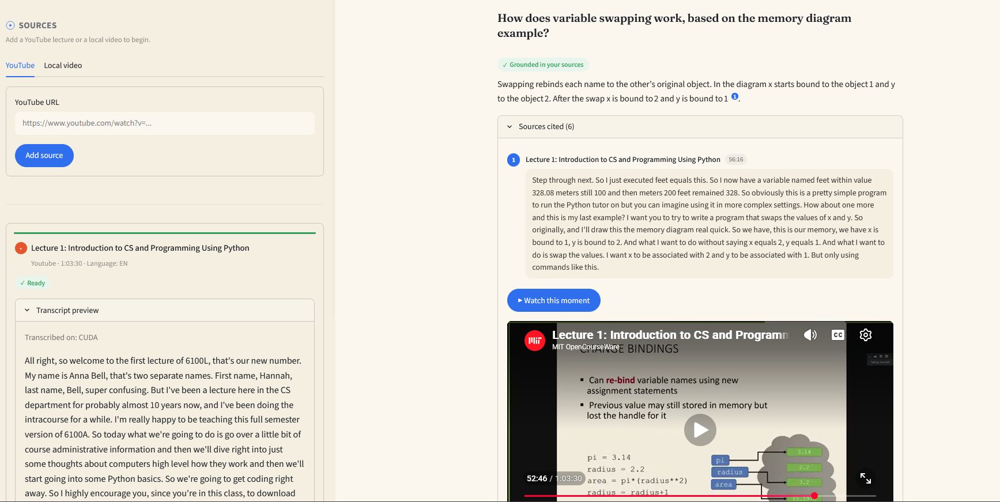

<div align="center">

# EduRAG

**Ask your lecture videos questions — get answers that are grounded, cited, and checked before you see them.**

EduRAG is a retrieval-augmented study assistant. Add a YouTube lecture or a local video, ask it a question, and get an answer generated *only* from that source — every claim checked against the evidence and cited down to the exact second it came from.

</div>

<br>

<div align="center">
  
</div>

<br>

## Why

Most "chat with your video" tools optimize for a fluent answer. EduRAG optimizes for a *trustworthy* one: it would rather say "the material doesn't cover this" than answer confidently from the model's own general knowledge. That priority order — accuracy and grounding first, everything else after — drives every design decision in this repo.

## What it does

- **Add a source.** Paste a YouTube URL or upload a local video file.
- **It gets processed, entirely on your own machine.** Audio is extracted and transcribed locally (word-level timestamps), then split into topic-aware chunks and indexed for hybrid search — no cloud service touches your video or its transcript at this stage.
- **Ask a question.** EduRAG retrieves the most relevant passages from *that* source, generates an answer that cites which passage backed each sentence, and independently verifies every individual claim against its cited evidence before showing it to you.
- **Every answer is labeled honestly.** Grounded, partially grounded, unverified, or abstained — a qualitative status, not a fabricated confidence score.
- **Every citation is playable.** Click "Watch this moment" under any cited passage and the source video plays from that exact second, so you can verify the answer yourself instead of taking it on faith.

<br>

<div align="center">
  
</div>

<br>

## How it works

Ingestion (slow, thorough, runs once per source) is deliberately kept separate from the query path (fast, runs on every question):

```
                          INGESTION (once per source)
  ┌──────────┐    ┌───────────┐    ┌────────────┐    ┌───────────────────┐
  │  Source   │ →  │  Audio    │ →  │ Local ASR  │ →  │  Semantic chunking │
  │(YouTube / │    │extraction │    │(faster-    │    │  + LLM contextual  │
  │local file)│    │ (ffmpeg)  │    │ whisper)   │    │  enrichment        │
  └──────────┘    └───────────┘    └────────────┘    └─────────┬──────────┘
                                                                 ↓
                                                     ┌───────────────────────┐
                                                     │  Hybrid index: dense   │
                                                     │ (Qdrant, embedded) +   │
                                                     │ sparse (BM25)          │
                                                     └───────────────────────┘

                              QUERY (every question)
  ┌──────────┐    ┌────────────────┐    ┌───────────┐    ┌───────────────────┐
  │ Question  │ →  │ Hybrid search   │ →  │  Cross-   │ →  │  Grounded answer   │
  │           │    │ (dense + BM25,  │    │  encoder  │    │  generation (Groq) │
  │           │    │  RRF-fused)     │    │  rerank   │    │  — cite or refuse  │
  └──────────┘    └─────────────────┘    └───────────┘    └─────────┬──────────┘
                                                                     ↓
                                                       ┌───────────────────────┐
                                                       │ Per-claim grounding    │
                                                       │ check (HHEM NLI) →     │
                                                       │ labeled, cited answer  │
                                                       └───────────────────────┘
```

Everything except the final answer-generation call runs locally — transcription, embedding, retrieval, reranking, and grounding verification never leave your machine. Generation is routed through Groq's hosted inference for speed; nothing else in the pipeline depends on a cloud service.

## Tech stack

| Layer | Choice |
|---|---|
| UI | Streamlit |
| App DB | SQLite + SQLAlchemy + Alembic |
| Video → audio | yt-dlp, ffmpeg |
| Transcription (local) | faster-whisper, word-level timestamps |
| Chunking | Word-count packing + embedding-similarity topic-boundary detection |
| Embeddings | `BAAI/bge-small-en-v1.5` |
| Vector search | Qdrant (embedded/local — no server to run) |
| Keyword search | BM25 (`rank-bm25`) |
| Fusion | Reciprocal Rank Fusion |
| Reranking | `cross-encoder/ms-marco-MiniLM-L-6-v2` |
| Generation | Groq (`openai/gpt-oss-120b`) |
| Grounding verification | Vectara HHEM-2.1 (`vectara/hallucination_evaluation_model`), per-claim NLI |

## Getting started

**Prerequisites:** Python 3.11+, [ffmpeg](https://ffmpeg.org/) on PATH, and a [Groq API key](https://console.groq.com/keys) (free tier works). No database server and no vector-store server to install — SQLite and Qdrant both run embedded, straight out of the box.

```bash
git clone https://github.com/Ankush-042/EduRAG.git
cd EduRAG

python -m venv .venv
.venv\Scripts\activate          # Windows
# source .venv/bin/activate     # macOS / Linux

pip install -r requirements.txt

copy .env.example .env          # Windows
# cp .env.example .env          # macOS / Linux
# then open .env and set GROQ_API_KEY

python -m streamlit run app/ui/main.py
```

Open the local URL Streamlit prints, add a YouTube lecture or upload a video from the sidebar, wait for it to reach **Ready**, then ask it a question.

### Running the eval harness

A small regression suite lives in `scripts/eval_cases.json` and runs against whatever source is currently indexed in your most recently active session:

```bash
python scripts/eval_answers.py
```

## Project layout

```
app/
├── core/          # settings, provider interfaces
├── db/            # models + repositories (SQLAlchemy)
├── services/       # ingestion, transcription, chunking, embedding,
│                    retrieval, reranking, generation, grounding
└── ui/            # Streamlit entry point
scripts/           # eval harness + diagnostics
alembic/           # DB migrations
```

## Scope, on purpose

A few things are deliberately out of scope for v1, not oversights: no PDF/document sources (video-only), English-only, and no accounts or persistent multi-session history (one temporary session per browser tab). Each of these was a real design decision, not a shortcut — see the module docstrings for the reasoning behind each one.

---

<div align="center">
<sub>Built by Ankush — final-year B.E. Computer Engineering, AI & ML.</sub>
</div>
